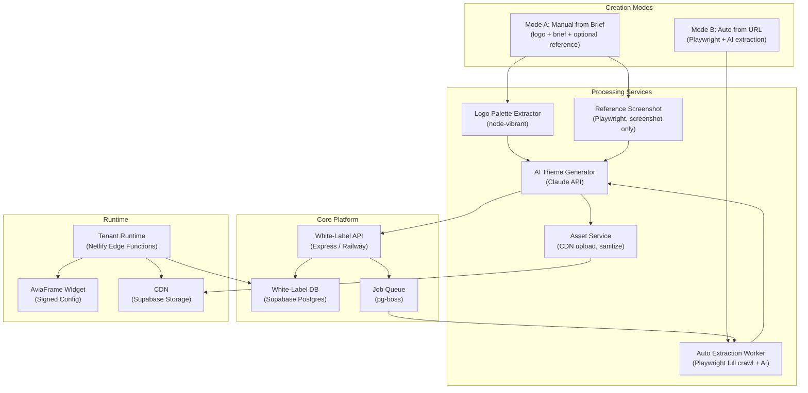

# AviaFrame White-Label Site Module
## Full Product + Technical Design for Engineering, QA, and UX

Version: `3.0`
Date: `2026-03-04`
Owner: `AviaFrame Product + Platform Team`

**Changelog v3.0 from v2.0:**
- Added second creation mode: **Manual from Brief** (logo + contacts + style brief + optional reference URL)
- Added logo-to-palette extraction service (`node-vibrant`)
- Added AI brief-to-theme generation pipeline
- Reference URL used as visual inspiration only (screenshot → AI), never as content source
- Restructured delivery phases: Phase 1 = Manual from Brief (no Playwright needed, ships faster), Phase 2 = Auto from URL, Phase 3 = Custom Domains + Governance
- Unified shared infrastructure for both modes (same preview, edit, publish, runtime)
- Engineering task lists updated per phase with concrete files/services

---

## Table of Contents

1. Executive Summary
2. Product Goals and Non-Goals
3. Creation Modes Overview
4. Users and Stakeholders
5. User Journeys
6. UX and UI Principles
7. Architecture Overview
8. Domain and Subdomain Strategy
9. Data Model
10. API Design
11. Manual from Brief Pipeline
12. Auto from URL Pipeline (Playwright + AI)
13. Shared: AI Theme Generation
14. Shared: Runtime Rendering (Netlify Edge Functions)
15. Widget Integration Contract
16. Security and Compliance
17. Observability and Operations
18. Caching Strategy
19. QA Strategy
20. Delivery Plan — Phase 1: Manual from Brief
21. Delivery Plan — Phase 2: Auto from URL
22. Delivery Plan — Phase 3: Custom Domains + Governance
23. Risks and Mitigations
24. Definition of Done
25. Runbook (Production)
26. Open Questions
27. Appendix A: API Validation Rules
28. Appendix B: QA Checklist
29. Appendix C: SEO Guidance
30. Appendix D: AI Prompt Templates

---

## 1. Executive Summary

The AviaFrame White-Label Site Module enables platform admins to provision a fully branded flight-booking site for any agency — in under 10 minutes — and publish it to a managed subdomain (`tour.aviaframe.com`) or a custom domain (`flights.agency.com`).

The module supports **two creation modes**, sharing a common data model, preview, editing, and publishing infrastructure:

| Mode | Input | When to use |
|---|---|---|
| **Manual from Brief** | Logo + brand name + contacts/social + style brief + optional reference URL | Agency has no website yet, or wants a fresh design from scratch |
| **Auto from URL** | Agency website URL | Agency has an existing website to extract branding from |

In both modes the output is identical:
- Branded header and footer with agency identity
- AviaFrame booking widget as the functional center, attributed to the agency
- Shareable preview URL before publish
- Versioned history with rollback
- Tenant-isolated runtime on global edge infrastructure

---

## 2. Product Goals and Non-Goals

### 2.1 Goals

- Launch a branded tenant site in **under 10 minutes** from admin input (both modes).
- Support agencies **with and without** an existing website.
- Increase booking conversion by reducing branding mismatch.
- Attribute all bookings to the correct agency for commission tracking.
- Support custom domains (`agency.com`) as a first-class Phase 3 feature.
- Maintain legal and IP compliance in all extraction and generation paths.
- Provide stable wildcard-subdomain routing with managed TLS.

### 2.2 Non-Goals

- Full 1:1 replication of third-party websites.
- Importing or executing arbitrary JavaScript from any external source.
- Functioning as a general-purpose CMS.
- Extracting or copying proprietary content, marketing copy, or page structure.
- Running extraction against authentication-gated pages.

---

## 3. Creation Modes Overview

### Mode A — Manual from Brief

The admin fills a short onboarding form. No external website is crawled.

**Input:**
- `logo` — image file upload (PNG, SVG, WebP, max 5MB)
- `brand_name` — agency display name
- `contacts` — email, phone, address (optional fields)
- `social_links` — array of `{network, url}` (optional)
- `color_prefs` — hex codes or descriptive text, e.g. "dark navy and gold" (optional)
- `style_brief` — freeform text describing the desired feel, up to 500 chars
- `reference_url` — a website the agency likes visually (optional; used as inspiration, not copied)

**Pipeline:**
1. Extract dominant color palette from logo (`node-vibrant`)
2. If `reference_url` provided: take Playwright screenshot → send thumbnail to AI for visual tone analysis only
3. AI generates complete `theme_tokens`, header layout, and footer layout from brief + logo palette + reference tone
4. Admin reviews draft in preview, edits, publishes

**Key constraint:** `reference_url` is used exclusively as a visual tone reference (warm vs cool, minimal vs rich, flat vs shadowed). No HTML, CSS, content, or assets are copied from it.

---

### Mode B — Auto from URL

The admin provides the agency's existing website URL. The system crawls and analyses it.

**Input:**
- `source_url` — publicly reachable `https://` URL
- `crawl_depth` — 1–3 (default: 2)
- `include_paths` — optional list of paths to prioritize
- `respect_robots_txt` — boolean (default: true)
- `use_ai_analysis` — boolean (default: true)

**Pipeline:**
1. Playwright headless render (full JS execution) — handles React/Next.js/Nuxt sites
2. DOM analysis: logo, favicon, colors, fonts, nav links, footer links
3. AI brand analysis from rendered HTML + desktop screenshot
4. Confidence scoring per field
5. Admin reviews with confidence badges, edits, publishes

---

### Shared Infrastructure

Both modes produce the same output schema and use identical infrastructure for:
- `site_version` (theme tokens, header/footer config, widget config, SEO config)
- Preview at `{slug}--preview.aviaframe.com`
- Theme editor with WCAG contrast validation
- Publish / rollback / version history
- Netlify Edge Functions runtime

---

## 4. Users and Stakeholders

### 4.1 Primary Users

| User | Responsibilities |
|---|---|
| `Platform Admin` | Creates sites, triggers pipelines, publishes |
| `Agency Manager` | Reviews branding, approves content, can edit via delegated access |
| `End Customer` | Books flights on the tenant-branded site |

### 4.2 Internal Stakeholders

- `Backend team` — APIs, pipeline orchestration, data model, job queue
- `Frontend team` — admin wizard, theme editor, runtime templates
- `Widget team` — signed config, event bridge, booking attribution
- `QA team` — functional, visual regression, security, E2E
- `DevOps/SRE` — DNS, wildcard TLS, Netlify Edge setup, container infra
- `Legal/Compliance` — reference URL and asset usage policies

---

## 5. User Journeys

### 5.1 Journey A — Manual from Brief (new agency, no website)

```
Admin: White-Label Sites → New Site → "Build from brief"
  ↓
Step 1 — Identity
  Upload logo | Enter brand name | Slug (tour → tour.aviaframe.com)

  ↓
Step 2 — Contacts & Social
  Email | Phone | Address | LinkedIn | Instagram | Facebook

  ↓
Step 3 — Style Brief
  [textarea] "Modern and professional. We work with business travelers.
              Clean look, minimal. Dark header. No gradients."
  Color preferences (optional): "Dark navy and gold accents"
  Reference URL (optional): "https://someairline.com — we like their layout"

  ↓
Step 4 — Generating… (~8–15 sec)
  • Extracting palette from logo...     ✓
  • Analyzing reference site...         ✓
  • Generating theme with AI...         ✓
  • Building header & footer...         ✓

  ↓
Step 5 — Review & Edit
  Split-pane: left = editor, right = live preview (desktop/mobile toggle)
  Preview URL shown: tour--preview.aviaframe.com  [Copy link]
  Edit: colors | fonts | shape | spacing | nav links | footer | contacts

  ↓
Step 6 — Publish
  → tour.aviaframe.com live ✓
  → Widget attributed to agency ✓
  → Booking confirmation sent with agency branding ✓
```

### 5.2 Journey B — Auto from URL (agency with existing website)

```
Admin: White-Label Sites → New Site → "Import from website"
  ↓
Step 1 — Source
  Agency URL | Slug

  ↓
Step 2 — Extracting… (~20–45 sec with Playwright)
  • Rendering page (full JavaScript)... ✓
  • Extracting logo, colors, fonts...   ✓
  • Analyzing with AI...                ✓
  • Uploading assets to CDN...          ✓

  ↓
Step 3 — Review & Edit
  Same editor as Mode A, but fields pre-filled from extraction
  Confidence badges: HIGH (green) / MEDIUM (yellow) / LOW (red, required)
  LOW fields block publish until resolved manually

  ↓
Step 4 — Publish
  Same as Mode A
```

---

## 6. UX and UI Principles

### 6.1 Admin Wizard Principles

- **Step-based, linear flow** for both modes. Admin cannot skip steps out of order.
- **Progress saved automatically** — admin can close and resume the wizard.
- **Confidence badges** on every auto-extracted or AI-generated field: `HIGH ≥ 0.8`, `MEDIUM 0.5–0.79`, `LOW < 0.5`.
- **Split-pane live preview** with instant token updates. No save needed to see changes.
- **Desktop / Mobile tab toggle** in preview pane.
- **Shareable preview URL** (`{slug}--preview.aviaframe.com`) shown from Step 5 onward. Link works in any browser, including on real mobile devices.
- **WCAG contrast warning** shown inline on color fields that fail AA. Publish blocked until resolved.
- **Destructive actions** (`Unpublish`, `Reset to extraction`, `Delete site`) require typed confirmation or two-step confirmation dialog.
- **Version history sidebar** shows all published versions with timestamps and rollback button.

### 6.2 End-User Site Principles

- Header and footer look native to the agency brand, not "AviaFrame-branded".
- Widget is the primary visual and functional element, above the fold on all breakpoints.
- No layout shift during widget mount (CLS ≤ 0.1). Widget container has fixed min-height.
- Responsive-first: tested at 360, 768, 1024, 1440px.
- Predictable keyboard navigation (header → widget → footer).
- "Powered by AviaFrame" attribution in footer (small, configurable visibility).

### 6.3 Accessibility

- WCAG 2.1 AA contrast enforced at save time for all theme color pairs.
- All interactive elements have visible focus styles.
- Imported images have `alt` text fallback.
- ARIA landmarks: `<header>`, `<main>`, `<footer>`.
- Widget is embedded with `title` attribute on container.

### 6.4 Brand Safety UX

- All auto-extracted and AI-generated assets labeled `Auto-generated` until admin explicitly approves.
- Legal disclaimer during reference URL input: *"The reference site is used for visual tone inspiration only. No content, code, or assets will be copied from it."*
- Reference URL analysis shows only AI description ("warm, minimal, flat design"), never raw extracted content.

---

## 7. Architecture Overview



### 7.1 Module Inventory

| Module | Language / Runtime | Host | Phase |
|---|---|---|---|
| `white-label-api` | Node.js / Express | Railway | 1 |
| `admin-white-label-ui` | React + Vite | Netlify (portal) | 1 |
| `logo-palette-service` | Node.js, `node-vibrant` | Railway (same process as API) | 1 |
| `ai-theme-service` | Node.js, Claude API | Railway (same process as API) | 1 |
| `tenant-runtime` | Deno / Netlify Edge Functions | Netlify Edge | 1 |
| `asset-service` | Node.js, Supabase Storage | Railway (same process as API) | 1 |
| `reference-screenshot-worker` | Node.js + Playwright | Railway (Chromium container) | 1 (lightweight) |
| `extraction-worker` | Node.js + Playwright (full crawl) | Railway (Chromium container) | 2 |

Note: Phases 1 and 2 share the same Chromium container — Phase 1 uses it only for single-page reference screenshot (fast, low memory), Phase 2 uses it for full multi-page crawl.

---

## 8. Domain and Subdomain Strategy

### 8.1 Default Subdomain

- Pattern: `{slug}.aviaframe.com`
- Slug rules:
  - Lowercase alphanumeric and hyphen only, regex: `^[a-z0-9][a-z0-9-]{1,38}[a-z0-9]$`
  - Length: 3–40 characters
  - Reserved words blocked: `www`, `admin`, `app`, `api`, `cdn`, `mail`, `static`, `support`, `preview`, `widget`, `booking`, `aviaframe`
- DNS: `*.aviaframe.com CNAME <netlify-team-site>.netlify.app`
- TLS: Netlify-managed wildcard `*.aviaframe.com`

### 8.2 Preview Subdomain

- Pattern: `{slug}--preview.aviaframe.com`
- Resolves to latest **saved draft** (not published version)
- Shareable, read-only, `X-Robots-Tag: noindex, nofollow`
- No authentication required
- Purged on each draft save (30s edge cache)

### 8.3 Custom Domain (Phase 3)

- Field `custom_domain TEXT UNIQUE` present in schema from Phase 1 (NULL until Phase 3)
- Agency sets CNAME `flights.agency.com → custom.aviaframe.com`
- TLS: Let's Encrypt auto-issued via Netlify Managed DNS or Cloudflare
- Tenant runtime matches both `{slug}.aviaframe.com` and `custom_domain`

---

## 9. Data Model

### 9.1 Entity Relationship Summary

```
agency (1) ──< white_label_site (1) ──< site_version (*)
                     │                        │
                     └──< brand_profile (1)   └── publish_event (*)
```

### 9.2 SQL DDL

```sql
-- ────────────────────────────────────────────
-- Core site entity
-- ────────────────────────────────────────────
create table white_label_site (
  id                  uuid primary key default gen_random_uuid(),
  agency_id           uuid not null references agencies(id) on delete restrict,
  slug                text not null unique
                        check (slug ~ '^[a-z0-9][a-z0-9-]{1,38}[a-z0-9]$'),
  custom_domain       text unique,              -- null in Phase 1-2; active in Phase 3
  creation_mode       text not null
                        check (creation_mode in ('manual_brief','auto_url')),
  source_url          text,                     -- null for manual_brief mode
  status              text not null default 'draft'
                        check (status in ('draft','published','unpublished','archived')),
  current_version_id  uuid,                     -- FK added after site_version
  created_at          timestamptz not null default now(),
  created_by          uuid not null references auth.users(id),
  updated_at          timestamptz not null default now(),
  updated_by          uuid not null references auth.users(id)
);

-- ────────────────────────────────────────────
-- Brand profile — output of either pipeline
-- ────────────────────────────────────────────
create table brand_profile (
  id                     uuid primary key default gen_random_uuid(),
  site_id                uuid not null references white_label_site(id) on delete cascade,
  creation_mode          text not null
                           check (creation_mode in ('manual_brief','auto_url')),

  -- Manual brief inputs (null for auto_url mode)
  brief_brand_name       text,
  brief_style_text       text,
  brief_color_prefs      text,
  brief_contacts         jsonb,                 -- {email, phone, address}
  brief_social_links     jsonb,                 -- [{network, url}]
  brief_reference_url    text,                  -- inspiration-only, not crawled

  -- Auto URL inputs (null for manual_brief mode)
  source_url             text,
  crawl_depth            int,

  -- Pipeline status
  extraction_status      text not null default 'pending'
                           check (extraction_status in
                             ('pending','running','completed','partial','failed')),

  -- Asset references
  logo_asset_id          uuid,
  favicon_asset_id       uuid,
  reference_screenshot_url text,               -- thumbnail of reference_url (brief mode)

  -- Extracted / generated color palette
  color_primary          text,
  color_secondary        text,
  color_accent           text,
  color_text             text,
  color_text_muted       text,
  color_background       text,
  color_surface          text,
  color_border           text,

  -- Extracted / generated typography
  font_family_heading    text,
  font_family_body       text,

  -- Extracted / generated shape and style
  border_radius_base     text,                 -- e.g. "8px"
  button_style           text
                           check (button_style in ('filled','outlined','ghost')),
  shadow_style           text
                           check (shadow_style in ('flat','soft','heavy','none')),
  spacing_scale          text
                           check (spacing_scale in ('compact','normal','spacious')),

  -- AI outputs
  ai_analysis_raw        jsonb not null default '{}'::jsonb,
  ai_summary             text,                 -- one-sentence brand description
  logo_palette_raw       jsonb not null default '{}'::jsonb, -- node-vibrant output

  -- Confidence per field (0.0–1.0); always 1.0 for manually entered fields
  extraction_confidence  jsonb not null default '{}'::jsonb,
  extraction_report      jsonb not null default '{}'::jsonb,

  created_at             timestamptz not null default now(),
  updated_at             timestamptz not null default now()
);

-- ────────────────────────────────────────────
-- Immutable version snapshots
-- ────────────────────────────────────────────
create table site_version (
  id             uuid primary key default gen_random_uuid(),
  site_id        uuid not null references white_label_site(id) on delete cascade,
  parent_id      uuid references site_version(id),  -- for diff display
  version_no     int not null,
  is_published   boolean not null default false,
  header_config  jsonb not null,               -- see §9.3
  footer_config  jsonb not null,               -- see §9.4
  theme_tokens   jsonb not null,               -- see §9.5
  widget_config  jsonb not null,               -- see §9.6
  seo_config     jsonb not null default '{}'::jsonb,  -- see §9.7
  legal_config   jsonb not null default '{}'::jsonb,
  created_at     timestamptz not null default now(),
  created_by     uuid not null references auth.users(id),
  unique(site_id, version_no)
);

alter table white_label_site
  add constraint fk_current_version
  foreign key (current_version_id) references site_version(id);

-- ────────────────────────────────────────────
-- Audit log
-- ────────────────────────────────────────────
create table publish_event (
  id              uuid primary key default gen_random_uuid(),
  site_id         uuid not null references white_label_site(id) on delete cascade,
  site_version_id uuid not null references site_version(id),
  event_type      text not null
                    check (event_type in ('publish','unpublish','rollback')),
  actor_id        uuid not null references auth.users(id),
  reason          text,
  metadata        jsonb not null default '{}'::jsonb,
  created_at      timestamptz not null default now()
);

-- ────────────────────────────────────────────
-- Indexes
-- ────────────────────────────────────────────
create index idx_wls_agency_id    on white_label_site(agency_id);
create index idx_wls_slug         on white_label_site(slug);
create index idx_wls_domain       on white_label_site(custom_domain)
                                    where custom_domain is not null;
create index idx_wls_status       on white_label_site(status);
create index idx_bp_site_id       on brand_profile(site_id);
create index idx_sv_site_id       on site_version(site_id);
create index idx_sv_published     on site_version(site_id, is_published)
                                    where is_published = true;
create index idx_pe_site_id       on publish_event(site_id, created_at desc);
```

### 9.3 `header_config` Schema

```json
{
  "logo_asset_id":         "uuid | null",
  "logo_url":              "https://cdn.aviaframe.com/...",
  "logo_alt":              "TourAgency logo",
  "brand_name":            "TourAgency",
  "show_brand_name":       true,
  "menu_items": [
    { "label": "Home",    "href": "/",        "open_in_new_tab": false },
    { "label": "Contact", "href": "/contact", "open_in_new_tab": false }
  ],
  "phone":                 "+971 4 123 4567",
  "show_phone":            true,
  "show_language_switcher": false,
  "layout":                "logo-left | logo-center",
  "background_token":      "color_primary | color_background | color_surface"
}
```

### 9.4 `footer_config` Schema

```json
{
  "links": [
    { "label": "Privacy",      "href": "/privacy" },
    { "label": "Terms",        "href": "/terms" }
  ],
  "social_links": [
    { "network": "linkedin",   "href": "https://linkedin.com/company/example" },
    { "network": "instagram",  "href": "https://instagram.com/example" }
  ],
  "contact_email":   "info@touragency.com",
  "contact_phone":   "+971 4 123 4567",
  "contact_address": "Dubai, UAE",
  "copyright_text":  "© 2026 TourAgency",
  "show_powered_by": true,
  "layout":          "single-row | three-column"
}
```

### 9.5 `theme_tokens` Schema

```json
{
  "color_primary":          "#004F9F",
  "color_primary_dark":     "#003A7A",
  "color_secondary":        "#F6F7FB",
  "color_accent":           "#E67E67",
  "color_text":             "#1A1A2E",
  "color_text_muted":       "#6B7280",
  "color_text_on_primary":  "#FFFFFF",
  "color_background":       "#FFFFFF",
  "color_surface":          "#F8F9FA",
  "color_border":           "#E5E7EB",
  "font_heading":           "Inter",
  "font_body":              "Inter",
  "font_size_base":         "16px",
  "font_weight_heading":    "700",
  "line_height_base":       "1.6",
  "border_radius_sm":       "4px",
  "border_radius_base":     "8px",
  "border_radius_lg":       "16px",
  "border_radius_full":     "9999px",
  "button_style":           "filled | outlined | ghost",
  "shadow_style":           "flat | soft | heavy | none",
  "spacing_scale":          "compact | normal | spacious"
}
```

All `color_text_*` on `color_*_background` pairs must pass WCAG AA (4.5:1 body, 3:1 large). Validated at save time by the API.

### 9.6 `widget_config` Schema

```json
{
  "widget_type":          "flight_search",
  "layout":               "embedded_center",
  "agency_id":            "8ab2e2de-d191-4df5-89f6-e8f839a459ee",
  "signed_config_token":  "jwt.token.here",
  "default_locale":       "en",
  "default_currency":     "AED",
  "default_origin":       "DXB",
  "default_passengers":   { "adults": 1, "children": 0, "infants": 0 },
  "price_display":        "b2c",
  "booking_url":          "https://api.aviaframe.com/n8n/webhook/drct/order/create",
  "checkout_url":         "https://tour.aviaframe.com/checkout"
}
```

`agency_id` is **required** — ensures every booking is attributed to the agency for commissions. `signed_config_token` is a short-lived JWT (24h) generated at publish and validated server-side by the widget on every order creation.

### 9.7 `seo_config` Schema

```json
{
  "title":            "Book Flights with TourAgency",
  "description":      "Search and book flights at the best prices with TourAgency.",
  "og_title":         "TourAgency — Flight Search & Booking",
  "og_description":   "Instant flight booking powered by AviaFrame.",
  "og_image_url":     "https://cdn.aviaframe.com/assets/og-tour.png",
  "canonical_domain": "tour.aviaframe.com",
  "robots":           "index,follow",
  "lang":             "en",
  "favicon_url":      "https://cdn.aviaframe.com/assets/favicon-tour.ico"
}
```

Note: preview subdomains always receive `X-Robots-Tag: noindex, nofollow` at the edge layer regardless of the `robots` value above.

---

## 10. API Design

### 10.1 Conventions

- Base path: `/api/v1/white-label`
- Content-Type: `application/json`
- Auth: `Authorization: Bearer <supabase-jwt>`
- All mutating endpoints require a valid admin session
- Publish/rollback require `Idempotency-Key: <uuid>` header
- All errors return the standardized envelope below

### 10.2 Error Envelope

```json
{
  "code":           "VALIDATION_ERROR",
  "message":        "Invalid slug format",
  "details": [
    { "field": "slug", "reason": "must match ^[a-z0-9][a-z0-9-]{1,38}[a-z0-9]$ and not be reserved" }
  ],
  "correlation_id": "a6d527cc-70da-49e2-b9a5-7c1a5fce9b7d"
}
```

---

### 10.3 Create Site (both modes)

`POST /api/v1/white-label/sites`

**Mode A — Manual from Brief:**
```json
{
  "agency_id":     "8ab2e2de-d191-4df5-89f6-e8f839a459ee",
  "slug":          "tour",
  "creation_mode": "manual_brief",
  "brand_name":    "TourAgency",
  "contacts": {
    "email":   "info@touragency.com",
    "phone":   "+971 4 123 4567",
    "address": "Dubai, UAE"
  },
  "social_links": [
    { "network": "linkedin",  "href": "https://linkedin.com/company/touragency" },
    { "network": "instagram", "href": "https://instagram.com/touragency" }
  ],
  "style_brief":    "Modern and professional. Dark navy header. Minimal. Business travelers.",
  "color_prefs":    "Dark navy and gold accents",
  "reference_url":  "https://emirates.com"
}
```

**Mode B — Auto from URL:**
```json
{
  "agency_id":          "8ab2e2de-d191-4df5-89f6-e8f839a459ee",
  "slug":               "tour",
  "creation_mode":      "auto_url",
  "source_url":         "https://agency-example.com",
  "crawl_depth":        2,
  "include_paths":      ["/", "/about"],
  "respect_robots_txt": true,
  "use_ai_analysis":    true
}
```

**Response `201`** (same for both modes):
```json
{
  "id":              "3f95d3cb-42e6-4f80-a2f3-5b7bd24e3025",
  "agency_id":       "8ab2e2de-d191-4df5-89f6-e8f839a459ee",
  "slug":            "tour",
  "creation_mode":   "manual_brief",
  "host":            "tour.aviaframe.com",
  "preview_host":    "tour--preview.aviaframe.com",
  "status":          "draft",
  "job_id":          "job_01JDDMPR6D6X2QJ7PK5N9E6J3Q",
  "created_at":      "2026-03-04T12:00:00Z"
}
```

The `job_id` can be polled via `GET /api/v1/white-label/jobs/{job_id}`.

---

### 10.4 Get Job Status

`GET /api/v1/white-label/jobs/{job_id}`

**Response `200` (running):**
```json
{
  "job_id":     "job_01JDDMPR6D6X2QJ7PK5N9E6J3Q",
  "status":     "running",
  "progress": {
    "step":     "ai_theme_generation",
    "steps_done": 3,
    "steps_total": 5
  }
}
```

**Response `200` (completed):**
```json
{
  "job_id":      "job_01JDDMPR6D6X2QJ7PK5N9E6J3Q",
  "status":      "completed",
  "site_id":     "3f95d3cb-42e6-4f80-a2f3-5b7bd24e3025",
  "duration_ms": 11400
}
```

---

### 10.5 Upload Logo (Manual Brief mode)

`POST /api/v1/white-label/sites/{site_id}/logo`

Content-Type: `multipart/form-data`
- field `logo`: image file (PNG, SVG, WebP, max 5MB)

**Response `200`:**
```json
{
  "asset_id":    "e2a0eacf-d242-4d65-8cb0-6c15b555d09f",
  "url":         "https://cdn.aviaframe.com/assets/logo-e2a0.png",
  "palette": {
    "vibrant":       "#004F9F",
    "dark_vibrant":  "#003A7A",
    "light_vibrant": "#4A80CC",
    "muted":         "#8FA8C8",
    "dark_muted":    "#2D4A6A",
    "light_muted":   "#C8D8E8"
  }
}
```

The `palette` is the raw `node-vibrant` output and informs AI theme generation.

---

### 10.6 Get Brand Profile

`GET /api/v1/white-label/sites/{site_id}/brand-profile`

**Response `200`:**
```json
{
  "site_id":           "3f95d3cb-42e6-4f80-a2f3-5b7bd24e3025",
  "creation_mode":     "manual_brief",
  "extraction_status": "completed",
  "theme": {
    "color_primary":       "#004F9F",
    "color_accent":        "#C9A227",
    "color_text":          "#1A1A2E",
    "color_background":    "#FFFFFF",
    "font_family_heading": "Inter",
    "border_radius_base":  "6px",
    "button_style":        "filled",
    "shadow_style":        "soft"
  },
  "assets": {
    "logo_url":    "https://cdn.aviaframe.com/assets/logo-e2a0.png",
    "favicon_url": "https://cdn.aviaframe.com/assets/favicon-e2a0.ico"
  },
  "ai_summary": "Professional corporate brand with navy and gold. Minimal layout, flat design, suited for business travel.",
  "confidence": {
    "logo":          1.0,
    "colors":        0.91,
    "typography":    0.80,
    "border_radius": 0.75,
    "button_style":  0.82,
    "nav":           0.95,
    "footer":        0.95
  }
}
```

Confidence is 1.0 for manually provided fields (logo upload, contacts). AI-generated values get 0.7–0.95 depending on how specific the brief was.

---

### 10.7 Save Draft Version

`PUT /api/v1/white-label/sites/{site_id}/versions/draft`

(See full request body in §9.3–9.7 schemas)

**Response `200`:**
```json
{
  "site_id":           "3f95d3cb-42e6-4f80-a2f3-5b7bd24e3025",
  "version_id":        "2ad31973-f3d2-4f9f-8df8-0d85f1ffca31",
  "version_no":        3,
  "status":            "draft_saved",
  "preview_url":       "https://tour--preview.aviaframe.com",
  "contrast_warnings": [],
  "updated_at":        "2026-03-04T12:14:00Z"
}
```

`contrast_warnings` example when palette fails AA:
```json
"contrast_warnings": [
  {
    "token_pair": "color_text on color_surface",
    "ratio":      3.1,
    "required":   4.5,
    "severity":   "error"
  }
]
```

---

### 10.8 Publish Version

`POST /api/v1/white-label/sites/{site_id}/publish`
`Idempotency-Key: <uuid>` (required)

```json
{ "version_id": "2ad31973-f3d2-4f9f-8df8-0d85f1ffca31" }
```

**Response `200`:**
```json
{
  "site_id":              "3f95d3cb-42e6-4f80-a2f3-5b7bd24e3025",
  "host":                 "tour.aviaframe.com",
  "status":               "published",
  "published_version_id": "2ad31973-f3d2-4f9f-8df8-0d85f1ffca31",
  "published_at":         "2026-03-04T12:20:00Z"
}
```

On publish, the API:
1. Validates all required fields (especially `widget_config.agency_id`)
2. Generates a new `signed_config_token` (24h JWT) via `widget-bridge`
3. Writes `publish_event`
4. Purges edge cache for `{slug}.aviaframe.com` via Netlify API

---

### 10.9 Rollback

`POST /api/v1/white-label/sites/{site_id}/rollback`
`Idempotency-Key: <uuid>` (required)

```json
{
  "target_version_id": "0d333fce-3ca4-4aca-9994-2d326bc75e7b",
  "reason":            "Header links broken after last publish"
}
```

**Response `200`:** same shape as publish, with updated `published_version_id`.

---

### 10.10 List Sites

`GET /api/v1/white-label/sites?agency_id={id}&status=published&page=1&per_page=20`

**Response `200`:**
```json
{
  "sites": [
    {
      "id":            "3f95d3cb-...",
      "slug":          "tour",
      "host":          "tour.aviaframe.com",
      "creation_mode": "manual_brief",
      "status":        "published",
      "agency_name":   "TourAgency",
      "updated_at":    "2026-03-04T12:20:00Z"
    }
  ],
  "total": 12,
  "page":  1
}
```

---

### 10.11 Get Version History

`GET /api/v1/white-label/sites/{site_id}/versions`

**Response `200`:**
```json
{
  "versions": [
    {
      "id":           "2ad31973-...",
      "version_no":   3,
      "is_published": true,
      "created_at":   "2026-03-04T12:14:00Z",
      "created_by_email": "admin@aviaframe.com"
    }
  ]
}
```

---

### 10.12 Set Custom Domain (Phase 3)

`PATCH /api/v1/white-label/sites/{site_id}/custom-domain`

```json
{ "custom_domain": "flights.agency.com" }
```

**Response `200`:**
```json
{
  "custom_domain": "flights.agency.com",
  "dns_instructions": {
    "type":    "CNAME",
    "name":    "flights",
    "value":   "custom.aviaframe.com",
    "status":  "pending_verification",
    "verify_by": "2026-03-11T12:00:00Z"
  }
}
```

---

## 11. Manual from Brief Pipeline

### 11.1 Overview

```
logo upload
    ↓
[1] Logo palette extraction (node-vibrant)
    ↓
[2] reference_url screenshot (Playwright, single page, 1080p)  ← if provided
    ↓
[3] AI reference tone analysis (thumbnail → Claude, inspiration only)  ← if ref provided
    ↓
[4] AI theme generation (brief + palette + tone hint → theme_tokens + header + footer)
    ↓
[5] Favicon generation (crop logo to square, save as .ico)
    ↓
[6] Initial site_version draft created
    ↓
[7] Job marked completed → admin sees preview
```

Total estimated duration: 8–15 seconds (no Playwright for reference = 3–6 sec).

### 11.2 Step 1 — Logo Palette Extraction

Uses `node-vibrant` (MIT license, no external API calls, runs in-process):

```js
import Vibrant from 'node-vibrant';

async function extractPalette(logoBuffer) {
  const palette = await Vibrant.from(logoBuffer).getPalette();
  return {
    vibrant:       palette.Vibrant?.hex,
    dark_vibrant:  palette.DarkVibrant?.hex,
    light_vibrant: palette.LightVibrant?.hex,
    muted:         palette.Muted?.hex,
    dark_muted:    palette.DarkMuted?.hex,
    light_muted:   palette.LightMuted?.hex,
  };
}
```

Color mapping logic (applied when `color_prefs` is absent or vague):

| Logo swatch | Maps to theme token |
|---|---|
| `DarkVibrant` | `color_primary` (header background, CTA) |
| `Vibrant` | `color_accent` (highlights, hover states) |
| `LightMuted` | `color_surface` |
| `DarkMuted` | `color_text` |
| White / near-white | `color_background` |

If `color_prefs` is provided as specific hex codes, those override logo-extracted values. If `color_prefs` is descriptive text (e.g., "dark navy and gold"), the AI interprets them in Step 4.

### 11.3 Step 2 — Reference URL Screenshot (Optional)

If `reference_url` is provided:
- Launch a lightweight Playwright page (same container as extraction worker)
- Navigate to `reference_url`, wait for `networkidle`, 1440×900 viewport
- Take a **screenshot only** — no DOM traversal, no HTML extraction, no asset download
- Resize screenshot to 400×225 thumbnail (WebP, 40KB max) for AI input
- Screenshot is stored in Supabase Storage as `brand_profile.reference_screenshot_url`

This is the **only** use of the reference URL. No content, CSS, links, or assets are read.

### 11.4 Step 3 — Reference Tone Analysis (Optional)

Send the 400×225 thumbnail to Claude Vision:

```
(See Appendix D for full prompt)
Prompt summary: "Describe the visual tone and mood of this website in 3 sentences.
Focus on: color temperature (warm/cool/neutral), layout density (minimal/rich),
visual weight (flat/shadowed/textured), formality (corporate/casual/luxury).
Do NOT describe the content or mention the brand name."
```

Output example:
```json
{
  "color_temperature": "cool and neutral",
  "layout_density":    "minimal, generous whitespace",
  "visual_weight":     "flat with subtle shadows",
  "formality":         "corporate, professional"
}
```

This tone description is passed as a hint into Step 4 — it influences shadow style, spacing scale, and color lightness, but does not override the logo palette.

### 11.5 Step 4 — AI Theme Generation

Send to Claude (text model, no image input needed in this step):

```
(See Appendix D for full prompt)
Inputs provided to AI:
- brand_name
- style_brief
- color_prefs (text or hex)
- logo_palette (node-vibrant output)
- reference_tone (from Step 3, or null)
- contacts (email, phone, address)
- social_links

Outputs requested:
- complete theme_tokens JSON (all 22 fields)
- header_config JSON (menu_items auto-populated from brand context)
- footer_config JSON (contacts + social populated from input)
- ai_summary (one sentence)
- confidence per token group
```

The AI must use logo palette colors as the starting point, then adjust based on brief tone. It must not invent colors unrelated to the logo unless `color_prefs` explicitly requests it.

### 11.6 Step 5 — Favicon Generation

If the uploaded logo is not square, crop center square region and convert to 32×32 `.ico` / 180×180 `.png` (Apple touch icon). Stored as `brand_profile.favicon_asset_id`.

### 11.7 Step 6 — Initial Draft Version

Create `site_version` with `version_no = 1`:
- `header_config` from AI output, with logo populated from upload
- `footer_config` from AI output, with contacts/social from form
- `theme_tokens` from AI output
- `widget_config` with `agency_id` from site, default locale/currency
- `seo_config.title = "{brand_name} — Flight Booking"`, `robots = "index,follow"`

---

## 12. Auto from URL Pipeline (Phase 2)

### 12.1 Overview

```
source_url
    ↓
[1] Validation + robots.txt check
    ↓
[2] Playwright headless render (full JS execution, multi-page)
    ↓
[3] DOM analysis (logo, favicon, colors, fonts, nav, footer)
    ↓
[4] AI brand analysis (HTML snippet + desktop screenshot → Claude)
    ↓
[5] Confidence scoring (heuristic + AI merged)
    ↓
[6] Asset download, sanitize, CDN upload
    ↓
[7] brand_profile written; initial draft version created
    ↓
[8] Job completed → admin reviews with confidence badges
```

Total estimated duration: 20–45 seconds.

### 12.2 Why Playwright (not fetch)

The majority of modern agency websites render via JavaScript (React, Next.js, Nuxt, Angular). A plain `fetch` returns an empty shell — no visible logo, no computed CSS variables, no rendered navigation.

Playwright runs full Chromium, executes all JS, and exposes the rendered DOM with computed styles. This is the only reliable way to extract branding from real-world agency websites.

### 12.3 Step 1 — Validation and SSRF Prevention

```js
// Block private ranges
const BLOCKED_RANGES = ['10.', '172.16.', '192.168.', '127.', '169.254.', '::1'];
const resolved = await dns.resolve4(hostname);
if (resolved.some(ip => BLOCKED_RANGES.some(r => ip.startsWith(r)))) {
  throw new Error('SSRF_BLOCKED');
}
```

- `source_url` must be `https://`
- Must resolve to a public IP (RFC1918 blocked)
- robots.txt fetched; if crawl disallowed, flag in extraction report and skip crawl

### 12.4 Step 2 — Playwright Render

```js
const browser = await chromium.launch({ args: ['--no-sandbox', '--disable-setuid-sandbox'] });
const page    = await browser.newPage();
await page.setViewportSize({ width: 1440, height: 900 });
await page.goto(sourceUrl, { waitUntil: 'networkidle', timeout: 30_000 });

const desktopShot  = await page.screenshot({ type: 'webp', quality: 60 });
await page.setViewportSize({ width: 375, height: 812 });
const mobileShot   = await page.screenshot({ type: 'webp', quality: 60 });

const extracted = await page.evaluate(() => ({
  html:           document.documentElement.outerHTML.slice(0, 50_000),
  computedVars:   extractCssVars(),       // --color-*, --font-* CSS custom properties
  logoUrls:       discoverLogoCandidates(),
  faviconUrl:     getFavicon(),
  navLinks:       getNavLinks(),
  footerLinks:    getFooterLinks(),
  bodyFontFamily: getComputedStyle(document.body).fontFamily,
  h1FontFamily:   document.querySelector('h1')
                    ? getComputedStyle(document.querySelector('h1')).fontFamily
                    : null,
}));
```

### 12.5 Step 3 — DOM Heuristic Analysis

| Target | Strategy |
|---|---|
| Logo | `img[alt*="logo"]`, `header img`, `[class*="logo"] img`, `og:image`, first `<svg>` in header with width > 80px |
| Favicon | `link[rel*="icon"]` ordered by size desc |
| Primary color | Most frequent non-neutral `background-color` in header, CTAs, buttons |
| Accent color | Hover/active computed color on primary CTA |
| Text color | `color` on `<body>` and `<p>` |
| Background | `body background-color` |
| Font heading | `font-family` on `h1` or `h2` |
| Font body | `font-family` on `body` |
| Border radius | `border-radius` on primary CTA button |
| Button style | Presence of background vs border vs both on CTA |
| Nav links | `<header> nav a`, `[role="navigation"] a` |
| Footer links | `<footer> a` grouped by vertical proximity |

### 12.6 Step 4 — AI Brand Analysis

```
(See Appendix D for full prompt)
Send to Claude:
- Truncated rendered HTML (8,000 tokens max)
- Desktop screenshot thumbnail (400×225, WebP)

Request: structured JSON with colors, fonts, nav, footer, personality, confidence
```

### 12.7 Step 5 — Confidence Merge

```js
function mergeConfidence(heuristic, ai) {
  return Object.fromEntries(
    Object.keys({ ...heuristic, ...ai }).map(field => [
      field,
      Math.max(heuristic[field] ?? 0, ai[field] ?? 0)
    ])
  );
}
```

Confidence thresholds:
- `HIGH ≥ 0.8` — green badge, pre-approved, no admin action required
- `MEDIUM 0.5–0.79` — yellow badge, admin review recommended
- `LOW < 0.5` — red badge, manual input required, publish blocked

### 12.8 Infrastructure Requirements

| Requirement | Value |
|---|---|
| Runtime | Node.js 20 + Playwright |
| Container base | `mcr.microsoft.com/playwright:v1.44.0-jammy` |
| Container size | ~1.3GB |
| Min RAM per worker | 1GB (Chromium requirement) |
| Timeout per job | 120s |
| Concurrency | Max 3 parallel jobs per worker |
| Queue | `pg-boss` on Supabase Postgres |
| Hosting | Railway (separate service from API) |

Phase 1 uses the same container but only for single-page screenshots (fast, < 5s, minimal RAM).

---

## 13. Shared: AI Theme Generation

### 13.1 Model Selection

| Task | Model | Reason |
|---|---|---|
| Logo palette analysis | `node-vibrant` (no AI) | Deterministic, fast, free |
| Reference tone analysis | `claude-haiku-4-5` | Fast, cheap ($0.001), visual input |
| Brief-to-theme generation | `claude-sonnet-4-6` | Better reasoning for coherent design systems |
| Auto URL brand analysis | `claude-sonnet-4-6` | Complex HTML + image analysis |

Estimated cost per site creation:
- Manual from Brief: $0.005–0.015
- Auto from URL: $0.01–0.03

### 13.2 Output Validation

After receiving AI JSON output:
- Parse with `JSON.parse()` (handle markdown code fences in response)
- Validate all color fields are valid hex (`/^#[0-9A-Fa-f]{6}$/`)
- Validate font names are non-empty strings
- Validate enum fields (`button_style`, `shadow_style`, `spacing_scale`) against allowed values
- Run WCAG contrast check on all `color_text_*` + `color_background_*` pairs
- Fall back to safe defaults for any field that fails validation

### 13.3 Determinism Note

AI output is non-deterministic. To ensure consistent previews for the same brief:
- Store AI raw output in `brand_profile.ai_analysis_raw`
- Admin edits override AI values — edits are always preserved
- Regeneration (re-run AI) is an explicit admin action, never automatic

---

## 14. Shared: Runtime Rendering (Netlify Edge Functions)

### 14.1 Request Flow

```
GET tour.aviaframe.com/
  ↓
Netlify Edge Function (Deno runtime, global CDN edge)
  ↓
Extract slug from Host header: "tour"
  ↓
Cache lookup (60s TTL): tenant config for slug "tour"
  ↓  [cache miss]
Supabase query: SELECT site_version WHERE slug='tour' AND is_published=true
  ↓
Render HTML template:
  - Inject theme_tokens as CSS custom properties
  - Render header (logo, nav, phone)
  - Render <div id="aviaframe-widget-root"> (fixed min-height)
  - Inject widget bootstrap script with signed_config_token
  - Render footer (links, social, copyright)
  - Inject SEO tags (<title>, <meta>, og:*)
  ↓
Set cache headers (Cache-Control: public, max-age=60)
Return 200 HTML
```

Preview routing: `Host` matches `{slug}--preview.aviaframe.com` → load draft version + `X-Robots-Tag: noindex, nofollow`.

### 14.2 Template Engine

Simple string interpolation — no full SSR framework needed. The page is structurally static (header + widget container + footer). Example:

```js
// edge-function/index.ts (Deno)
export default async function handler(request: Request): Promise<Response> {
  const host   = new URL(request.url).hostname;         // "tour.aviaframe.com"
  const slug   = extractSlug(host);                     // "tour"
  const isPreview = host.includes('--preview');

  const config = await getTenantConfig(slug, isPreview); // Supabase + cache
  if (!config) return fallbackResponse();

  const html = renderTemplate(config);
  return new Response(html, {
    headers: {
      'Content-Type': 'text/html; charset=utf-8',
      'Cache-Control': isPreview ? 'no-store' : 'public, max-age=60, stale-if-error=300',
      ...(isPreview ? { 'X-Robots-Tag': 'noindex, nofollow' } : {}),
    },
  });
}
```

### 14.3 CSS Custom Properties Injection

Theme tokens are injected as a `<style>` block:

```html
<style>
  :root {
    --color-primary:     #004F9F;
    --color-accent:      #E67E67;
    --color-text:        #1A1A2E;
    --color-background:  #FFFFFF;
    --font-heading:      Inter, sans-serif;
    --font-body:         Inter, sans-serif;
    --border-radius-base:8px;
    /* ... all 22 tokens */
  }
</style>
```

### 14.4 Performance Targets

| Metric | Target |
|---|---|
| TTFB p95 | ≤ 400ms |
| LCP p75 (4G mobile) | ≤ 2.5s |
| CLS | ≤ 0.1 (widget container has fixed min-height) |
| Widget mount after shell | ≤ 1.2s |
| Tenant config cache hit ratio | ≥ 95% |

### 14.5 Fallback

When tenant config is unavailable (Supabase timeout or uncached):
- Serve static fallback: AviaFrame default theme + booking widget, no agency branding
- HTTP 200 (not 5xx) to preserve user experience
- Log `TENANT_CONFIG_UNAVAILABLE` with `tenant_host` and `correlation_id`

---

## 15. Widget Integration Contract

### 15.1 JS SDK Embed (Preferred)

```html
<div id="aviaframe-widget-root" style="min-height: 280px;"></div>
<script src="https://cdn.aviaframe.com/widget/v2/sdk.js" defer></script>
<script>
  window.AviaframeWidget.init({
    target:       '#aviaframe-widget-root',
    tenantHost:   window.location.host,
    signedConfig: '__SIGNED_CONFIG_TOKEN__',
    locale:       'en',
    currency:     'AED'
  });
</script>
```

### 15.2 Signed Config Token

JWT signed by `widget-bridge` with secret `WIDGET_TOKEN_SECRET`, 24h expiry:

```json
{
  "agency_id":     "8ab2e2de-d191-4df5-89f6-e8f839a459ee",
  "tenant_host":   "tour.aviaframe.com",
  "price_display": "b2c",
  "default_origin":"DXB",
  "iat": 1741000000,
  "exp": 1741086400
}
```

Widget validates this token on every `POST /orders/create` request. Bookings with invalid or expired tokens are rejected. Token is rotated on every publish.

### 15.3 iFrame Embed (Strict Isolation)

```html
<iframe
  src="https://widget.aviaframe.com/embed?tenant=tour&token=__SIGNED_CONFIG_TOKEN__"
  width="100%"
  height="600"
  frameborder="0"
  allow="payment"
  title="Flight Search"
></iframe>
```

### 15.4 Event Contract

All events include `correlation_id`, `tenant_id`, `agency_id`, `session_id`:

| Event | Payload |
|---|---|
| `widget_loaded` | `{ load_time_ms }` |
| `search_submitted` | `{ origin, destination, depart_date, passengers }` |
| `offer_selected` | `{ offer_id, price, currency, airline }` |
| `checkout_started` | `{ offer_id, passenger_count }` |
| `booking_completed` | `{ order_id, order_number, total_price, currency }` |
| `booking_failed` | `{ error_code, error_message }` |

---

## 16. Security and Compliance

### 16.1 Core Controls

| Control | Details |
|---|---|
| CSP | Strict; deny inline scripts; allow only `cdn.aviaframe.com`, `widget.aviaframe.com` |
| HTML sanitization | All extracted/AI-generated nav and footer text run through DOMPurify |
| SSR escaping | All dynamic values HTML-escaped before template insertion |
| Signed widget token | JWT, rotated on each publish, validated server-side |
| No external JS | Zero passthrough of scripts from any external source |

### 16.2 SSRF Prevention (Extraction Worker)

```
Blocked:
- RFC1918: 10.0.0.0/8, 172.16.0.0/12, 192.168.0.0/16
- Loopback: 127.0.0.0/8
- Link-local: 169.254.0.0/16
- IPv6 loopback: ::1
- Metadata endpoints: 169.254.169.254 (AWS/GCP/Azure)

Process:
1. Parse URL hostname
2. DNS resolve to IP
3. Check IP against blocked ranges
4. Proceed only if clean
```

Reference URL in Manual Brief mode goes through the same SSRF check before Playwright opens it.

### 16.3 Tenant Isolation

- All DB queries include mandatory `agency_id` scope
- Host-based tenant resolution with no fallback to wildcard lookup
- Cross-tenant boundary tests in CI (automated)
- No shared mutable state between tenant sessions at edge

### 16.4 Legal and IP Compliance

- Auto URL extraction: brand identity only (logo, colors, fonts, nav structure)
- Reference URL in Manual Brief: screenshot + AI tone description only — no HTML, CSS, content, or assets extracted
- Admin must acknowledge legal disclaimer before any extraction or reference analysis
- Extracted assets re-hosted on `cdn.aviaframe.com`, never hotlinked
- `respect_robots_txt: true` default; override requires explicit admin action

### 16.5 Abuse Prevention

| Control | Limit |
|---|---|
| Extraction jobs per agency per hour | 5 |
| Reference screenshots per hour | 10 |
| Asset download max size | 10MB per file |
| Crawl pages max | 10 in MVP |
| MIME type allowlist for uploads | PNG, SVG, WebP, ICO |
| Malware scan | MIME check + magic bytes validation |

---

## 17. Observability and Operations

### 17.1 Structured Log Fields

Every request includes:
```json
{
  "correlation_id":  "a6d527cc-...",
  "tenant_host":     "tour.aviaframe.com",
  "tenant_id":       "3f95d3cb-...",
  "agency_id":       "8ab2e2de-...",
  "site_version_id": "2ad31973-...",
  "creation_mode":   "manual_brief"
}
```

### 17.2 Metrics

| Metric | Labels |
|---|---|
| `wl_jobs_total` | `status`, `creation_mode` |
| `wl_job_duration_ms` | `creation_mode` |
| `wl_ai_cost_usd` | `model`, `step` |
| `wl_publish_total` | `status` |
| `wl_tenant_requests_total` | `host`, `status_code` |
| `wl_cache_hit_ratio` | — |
| `wl_contrast_warnings_total` | — |
| `wl_widget_load_ms` | `tenant_host` |

### 17.3 Alerts

| Condition | Severity |
|---|---|
| Job failure rate > 10% in 30 min | P1 |
| Tenant runtime 5xx rate > 1% | P1 |
| Publish failure > 5% in 15 min | P1 |
| AI API error rate > 20% | P2 |
| Job queue lag > 5 min | P2 |
| Wildcard TLS expiry < 14 days | P2 |
| Cache hit ratio < 80% | P3 |

---

## 18. Caching Strategy

| Layer | TTL | Purge trigger |
|---|---|---|
| Edge — published tenant config | 60s | `publish`, `unpublish`, `rollback` |
| Edge — preview config | 30s | Any `PUT /versions/draft` |
| CDN assets (logo, favicon) | Immutable (content-hash) | New upload only |
| Stale-if-error | 5 min | — |
| AI output cache | Not cached — stored in DB | Regenerate is explicit admin action |

Cache purge on publish calls `POST https://api.netlify.com/api/v1/sites/{site_id}/deploys` via Netlify purge hook.

---

## 19. QA Strategy

### 19.1 Functional Test Areas

**Both modes:**
- Site creation, slug validation, reserved slug rejection, duplicate slug
- Preview URL accessible before publish, reflects draft not published
- Draft save auto-generates `version_no` correctly
- Publish: `current_version_id` updated, `publish_event` written, edge cache purged
- Rollback: old version served, `publish_event` with `event_type=rollback` written
- Rollback to non-existent version: 404
- `widget_config.agency_id` present in all published versions
- Booking completed on tenant site: `agency_id` in order record matches

**Mode A — Manual from Brief:**
- Logo upload: palette extracted, asset stored, URL returned
- Brief + palette → AI generates all 22 theme tokens, header, footer
- Reference URL provided → tone analysis influences `shadow_style` and `spacing_scale`
- Reference URL blocked if private IP
- `color_prefs` hex override palette from logo
- Contacts + social populated in `footer_config`

**Mode B — Auto from URL:**
- JS-rendered site (React): logo and colors extracted correctly via Playwright
- Low-confidence field blocks publish until filled
- Partial extraction: safe fallback theme applied, gaps shown in UI
- `robots.txt` disallow: extraction skipped, report flag shown

### 19.2 Visual Regression Tests

- Snapshot comparison after any template change (all breakpoints: 360, 768, 1024, 1440)
- Dark-primary-color site vs light-primary-color site
- Long brand name, long nav labels, long footer text (overflow handling)
- RTL locale rendering

### 19.3 Security Tests

- XSS payload in `style_brief`, nav label, footer link label → sanitized in rendered HTML
- XSS in logo filename → sanitized
- `reference_url` pointing to `http://192.168.1.1` → SSRF blocked
- `source_url` with redirect chain to private IP → SSRF blocked
- Host header spoofing: `X-Forwarded-Host: admin.aviaframe.com` → blocked
- Cross-tenant read: authenticated as agency A, attempt to read agency B site → 403
- Signed config token forgery → widget rejects booking

### 19.4 Performance Tests

- 1000 concurrent tenant page requests (cache warm)
- 50 concurrent tenant requests (cold — Supabase lookup)
- 20 concurrent extraction jobs (Playwright memory)
- Cache invalidation latency after publish (target: < 5s edge propagation)

### 19.5 E2E Scenarios (Minimum for Phase 1)

1. Upload logo → enter brief → generate → review → publish → open `{slug}.aviaframe.com` in browser → widget loads → complete booking → confirm `agency_id` in order.
2. Enter brief without reference URL → theme generated with logo palette only.
3. Submit low-contrast color pair → publish blocked with contrast warning.
4. Save draft → open preview URL on mobile device → correct branding shown.
5. Publish → rollback to v1 → `tour.aviaframe.com` shows v1 branding.
6. `reference_url` = private IP → blocked with SSRF error.

---

## 20. Delivery Plan — Phase 1: Manual from Brief

**Duration: 5–6 weeks**
**Goal:** Ship the Manual from Brief mode end-to-end. No Playwright full-crawl needed. Get the product in front of real agencies.

### 20.1 Why Phase 1 = Manual from Brief

- No Chromium full-crawl infrastructure needed — simpler, faster to ship
- Serves agencies with no existing website (large share of the target market)
- Establishes all shared infrastructure (data model, preview, publish, runtime) that Phase 2 reuses
- Reference URL screenshot uses the same Playwright container but only for a single screenshot (~2s vs 30-45s for full crawl)

### 20.2 Backend Engineering Tasks

**Week 1-2: Foundation**

- [ ] DB migration: `white_label_site`, `brand_profile`, `site_version`, `publish_event` tables + indexes
- [ ] `POST /api/v1/white-label/sites` (manual_brief mode)
- [ ] `POST /api/v1/white-label/sites/{site_id}/logo` (multipart upload + node-vibrant palette)
- [ ] `GET /api/v1/white-label/jobs/{job_id}`
- [ ] Logo upload to Supabase Storage with content-hash filename

**Week 2-3: Pipeline**

- [ ] `logo-palette-service`: `node-vibrant` wrapper, palette-to-token mapping logic
- [ ] `reference-screenshot-worker`: Playwright single-page screenshot, resize to 400×225 thumbnail, SSRF check
- [ ] `ai-theme-service`: Claude API integration, prompt templates (Appendix D), output validation + fallback
- [ ] `widget-bridge`: signed config token generation (JWT)
- [ ] Job queue setup: `pg-boss` on Supabase Postgres, producer in API, consumer in worker

**Week 3-4: Core API**

- [ ] `PUT /api/v1/white-label/sites/{site_id}/versions/draft` + WCAG contrast validation
- [ ] `POST /api/v1/white-label/sites/{site_id}/publish` + cache purge hook + `publish_event` write
- [ ] `POST /api/v1/white-label/sites/{site_id}/rollback`
- [ ] `GET /api/v1/white-label/sites/{site_id}/brand-profile`
- [ ] `GET /api/v1/white-label/sites/{site_id}/versions`
- [ ] `GET /api/v1/white-label/sites` (list with filters)

**Week 4: Security + Observability**

- [ ] SSRF check for reference_url (IP range block + redirect chain check)
- [ ] HTML sanitization on all user-input fields in header/footer config
- [ ] Structured logging with `correlation_id`, `tenant_id`, `agency_id`
- [ ] Metrics instrumentation (`wl_jobs_total`, `wl_publish_total`, `wl_ai_cost_usd`)
- [ ] Alert rules: job failure rate, publish failure, AI error rate

### 20.3 Frontend Engineering Tasks

**Week 2-3: Admin Wizard**

- [ ] Route `/admin/white-label/sites/new` — mode selector (Manual from Brief / Import from URL)
- [ ] Step 1: Identity form (logo upload with drag-drop, brand name, slug with availability check)
- [ ] Step 2: Contacts & Social form
- [ ] Step 3: Style Brief form (textarea for brief, color preferences, reference URL with disclaimer)
- [ ] Step 4: Generation progress screen (polled job status, step labels)
- [ ] Step 5: Review & Edit — split-pane layout with live preview iframe on right

**Week 3-4: Theme Editor**

- [ ] Color token editor (color pickers for each token, grouped by purpose)
- [ ] WCAG contrast badge on color pair fields (calculated client-side in real time)
- [ ] Font selector (Google Fonts + system fonts)
- [ ] Shape/spacing controls (border radius, button style, shadow, spacing scale)
- [ ] Header editor: logo, menu items (add/remove/reorder), phone, layout
- [ ] Footer editor: links, social links, copyright text
- [ ] Desktop / Mobile preview toggle
- [ ] "Copy preview URL" button
- [ ] Save draft (auto-save on blur, manual save button)

**Week 4-5: Publish and History**

- [ ] Publish button + confirmation dialog (shows `tour.aviaframe.com` target)
- [ ] Unpublish / Delete confirmation dialogs
- [ ] Version history sidebar with rollback button
- [ ] Sites list page (`/admin/white-label/sites`)
- [ ] Site detail page with status badge and quick-action buttons

### 20.4 DevOps Tasks (Week 1)

- [ ] Configure `*.aviaframe.com` wildcard CNAME → Netlify Team plan requirement confirmed
- [ ] Netlify Edge Function deployment setup for tenant runtime
- [ ] Railway service: `white-label-api` (Node.js 20, env vars from Railway Variables)
- [ ] Railway service: `playwright-worker` (Chromium container, separate service)
- [ ] Supabase Storage bucket: `white-label-assets`, public CDN URL at `cdn.aviaframe.com/assets/`
- [ ] Netlify cache purge token in Railway env vars
- [ ] UptimeRobot monitor: `api.aviaframe.com/healthz`

### 20.5 Phase 1 Acceptance Criteria

- Admin creates and publishes a branded site from a logo + brief in ≤ 10 minutes
- Subdomain routing and TLS work for all published tenants
- Preview URL opens on a real mobile device and shows correct branding
- Widget books a flight and `agency_id` in the order matches the site config
- WCAG contrast failure blocks publish
- Reference URL SSRF attack is blocked

---

## 21. Delivery Plan — Phase 2: Auto from URL

**Duration: 4–5 weeks (after Phase 1 ships)**
**Goal:** Add Mode B (Auto from URL) using the same preview/edit/publish infrastructure from Phase 1.

### 21.1 Backend Engineering Tasks

**Week 1-2: Extraction Worker**

- [ ] Upgrade Playwright worker: from single-screenshot to full multi-page crawl
- [ ] robots.txt fetch and respect logic
- [ ] DOM analysis module: logo candidates, favicon, nav links, footer links, computed styles
- [ ] Heuristic confidence scoring per field
- [ ] Asset downloader: batch download, MIME check, magic bytes, malware scan stub
- [ ] Asset sanitization: strip EXIF, convert to safe formats

**Week 2-3: AI Integration for Auto Mode**

- [ ] AI brand analysis prompt (different from brief-to-theme prompt; see Appendix D)
- [ ] Confidence merge: `max(heuristic, ai)` per field
- [ ] Handling partial extraction: fields below LOW threshold flagged as mandatory manual input

**Week 3: API Extensions**

- [ ] `POST /api/v1/white-label/sites` accept `auto_url` creation mode
- [ ] `POST /api/v1/white-label/sites/{site_id}/extract-brand` (re-extraction trigger)
- [ ] `GET /api/v1/white-label/sites/{site_id}/brand-profile` — add `extraction_confidence` per field

**Week 4: QA + Security**

- [ ] Cross-tenant isolation test automation added to CI
- [ ] SSRF test suite (private IP, redirect chain, metadata endpoint)
- [ ] Visual regression baseline for auto-extracted sites
- [ ] E2E: JS-rendered agency site → extract → publish → booking

### 21.2 Frontend Engineering Tasks

- [ ] Mode selector in wizard: add "Import from website" card
- [ ] Extraction progress screen (different step labels: "Rendering page", "Extracting branding", "Analyzing with AI")
- [ ] Confidence badge component on each editor field (`HIGH` / `MEDIUM` / `LOW`)
- [ ] LOW-confidence field: highlight red, show placeholder, block publish until filled
- [ ] "Re-extract" button in brand profile section (triggers fresh extraction)
- [ ] Extraction report drawer: shows what was found, what was missing, AI summary

### 21.3 Phase 2 Acceptance Criteria

- JS-rendered agency site (React/Next.js) extracted correctly (logo + colors + nav visible)
- LOW-confidence logo blocks publish until manually uploaded
- Re-extraction replaces existing brand profile and resets affected token fields
- All Phase 1 acceptance criteria continue to pass

---

## 22. Delivery Plan — Phase 3: Custom Domains + Governance

**Duration: 3–4 weeks (after Phase 2 ships)**
**Goal:** Custom domain support, approval workflow, per-tenant analytics.

### 22.1 Features

**Custom Domains**
- `PATCH /api/v1/white-label/sites/{site_id}/custom-domain`
- DNS instruction display in admin
- DNS verification polling (check CNAME every 10 min via background job)
- Let's Encrypt TLS issuance via Netlify Managed DNS or Cloudflare API
- Tenant runtime matches both `slug.aviaframe.com` and `custom_domain`

**Approval Workflow**
- New site status: `draft → pending_review → approved → published`
- `Agency Manager` role: can edit but not publish; submits for review
- `Platform Admin` role: reviews and approves
- Email notification on status change

**Per-Tenant Analytics**
- `booking_completed` widget events stored in analytics table per `tenant_id`
- Admin dashboard: bookings count, revenue, conversion rate per tenant site
- Exportable CSV report per site

**Phase 3 Acceptance Criteria**
- Custom domain `flights.agency.com` resolves to correct tenant with valid TLS
- DNS verification polling detects CNAME within 15 minutes of propagation
- Agency manager can edit but is blocked from publishing without admin approval
- Tenant booking analytics visible in admin

---

## 23. Risks and Mitigations

| Risk | Likelihood | Impact | Mitigation |
|---|---|---|---|
| AI generates incoherent theme from vague brief | Medium | Medium | Structured prompt with explicit JSON schema; fallback to safe defaults on validation failure |
| logo palette extraction fails (SVG, transparent logo) | Medium | Medium | Multiple fallback strategies; manual color entry always available |
| Playwright single-page screenshot OOM in Phase 1 | Low | Low | Short timeout (15s), low memory per screenshot job |
| Playwright full crawl OOM in Phase 2 | Medium | Medium | Isolated container, 1GB memory limit, max 3 concurrent |
| Legal concern over reference URL usage | Low | High | Screenshot only, AI tone description only, legal disclaimer, no content extracted |
| Cross-tenant data leak | Low | Critical | Mandatory agency_id scope, host validation middleware, isolation tests in CI |
| SSRF via reference_url or source_url | Low | Critical | IP range block, DNS re-check after resolve, redirect chain check |
| Netlify wildcard domain requires Team plan | Confirmed | High | Budget for Netlify Team plan before Phase 1 starts |
| AI API rate limit during burst | Low | Medium | Retry with backoff, job queue prevents burst |
| Signed config token theft | Very Low | High | 24h expiry, rotated on publish, server-side validation |

---

## 24. Definition of Done (per Phase)

Each phase is done when:
- [ ] Code implemented, unit-tested (≥ 80% coverage on services), peer-reviewed, merged to main
- [ ] API docs in sync with real behavior (all examples tested)
- [ ] Security checks passed (XSS, SSRF, tenant isolation, CSP)
- [ ] QA E2E pack green in staging
- [ ] Performance targets met in staging load test
- [ ] Production runbook updated
- [ ] Alerting active and tested with synthetic failure
- [ ] Product acceptance walkthrough completed

---

## 25. Runbook (Production)

### 25.1 Job Stuck in `running`

1. Find job in `pg-boss` queue: `SELECT * FROM pgboss.job WHERE name='brand-extraction' AND state='active'`
2. Check worker logs for `correlation_id`
3. If worker crashed: update job state to `failed`, notify admin via dashboard
4. Re-run via `POST /sites/{site_id}/extract-brand` or ask admin to retry

### 25.2 Publish Failure

1. Check `publish_event` for `metadata.error`
2. Validate `site_version`: all required JSONB fields present, `widget_config.agency_id` not null
3. Check Netlify API cache purge response in logs
4. Retry publish with new `Idempotency-Key`

### 25.3 Tenant Site 5xx

1. Check Edge Function logs: `correlation_id`, `tenant_host`
2. Verify tenant exists and is published: `SELECT * FROM white_label_site WHERE slug='...'`
3. Check Supabase connectivity from Edge
4. Roll back `current_version_id` to last known good via `/rollback`

### 25.4 AI API Failures

- Pipeline continues without AI step (heuristic only for Mode B, safe defaults for Mode A)
- Admin sees `ai_summary: null` and lower confidence scores
- Alert fires at 20% error rate (§17.3)
- Check Anthropic API status at `status.anthropic.com`

### 25.5 Wildcard TLS Expiry

- Alert fires at 14 days before expiry (§17.3)
- Netlify auto-renews — check Netlify dashboard under Domain Management
- If renewal failed: re-verify DNS record and trigger manual renewal via Netlify API

---

## 26. Open Questions

- Is platform admin the only role that creates and publishes sites in Phase 1, or do agency managers get self-serve access from day one?
- Which assets are permitted by default via reference URL in Manual Brief mode: screenshot only (current design) or also logo from the reference site?
- Multi-locale runtime (`/ar`, `/ru`) — Phase 3 or later?
- Should the preview URL require any authentication, or is it open to anyone with the link?
- Commission tracking: is `agency_id` in the signed widget config token sufficient for billing, or is a separate verification step needed?
- "Powered by AviaFrame" footer attribution — is it always shown, or can white-label completely hide it (premium plan feature)?

---

## 27. Appendix A: API Validation Rules

| Field | Rule |
|---|---|
| `slug` | `^[a-z0-9][a-z0-9-]{1,38}[a-z0-9]$`, not a reserved word, unique |
| `source_url` | `https://` only, publicly reachable, resolves to non-private IP |
| `reference_url` | `https://` only, resolves to non-private IP |
| `custom_domain` | Valid FQDN, not `*.aviaframe.com`, unique |
| `logo` upload | PNG / SVG / WebP / ICO, max 5MB, MIME + magic bytes validated |
| `style_brief` | Max 500 chars |
| `brand_name` | Max 80 chars, non-empty |
| `header_config.menu_items` | Max 10 items, each `label` max 40 chars |
| `footer_config.links` | Max 20 items |
| `theme_tokens` colors | Valid `#RRGGBB` hex, all text-on-background pairs must pass WCAG AA |
| `widget_config.agency_id` | Required, must reference an active agency |
| `seo_config.title` | Max 70 chars |
| `seo_config.description` | Max 160 chars |

---

## 28. Appendix B: QA Checklist

**Phase 1 — Manual from Brief**
- [ ] Upload PNG logo → palette extracted, 6 swatches returned
- [ ] Upload SVG logo → palette extracted (rasterize first)
- [ ] Brief with no color prefs → logo palette used for all color tokens
- [ ] Brief with hex color prefs → hex values override logo palette
- [ ] Reference URL = private IP → SSRF error returned
- [ ] Reference URL = valid site → screenshot taken, tone analysis influences tokens
- [ ] AI fails (simulated) → safe default theme applied, no 500 to admin
- [ ] Generated theme with low-contrast pair → contrast warning shown, publish blocked
- [ ] Fix contrast → contrast warning cleared → publish succeeds
- [ ] Preview URL opened on real mobile → correct branding, widget loads
- [ ] Booking completed on tenant site → order.agency_id = site.agency_id
- [ ] Rollback → v1 branding served within 5s

**Phase 2 — Auto from URL**
- [ ] Static HTML site → logo and colors extracted correctly
- [ ] React SPA site → logo and colors extracted (not empty shell)
- [ ] robots.txt disallow → extraction skipped, flag shown
- [ ] LOW confidence logo → publish blocked, red badge shown
- [ ] Fill manual logo upload → LOW badge cleared → publish succeeds
- [ ] Re-extract → existing brand profile replaced

**Security**
- [ ] XSS in `style_brief` → HTML-escaped in rendered page
- [ ] XSS in `menu_items[0].label` → sanitized
- [ ] Forged `Host: admin.aviaframe.com` header → blocked
- [ ] Agency A JWT accessing agency B site → 403
- [ ] Widget signed token expired → booking rejected

---

## 29. Appendix C: SEO Guidance

Tenant sites are structurally thin (header + widget + footer). For Phase 1, SEO is a secondary concern — the primary use case is a branded booking link shared directly by the agency with its clients (not organic search).

For agencies seeking search visibility (Phase 2+):

- **`ld+json` Structured Data** injected in runtime template:
  ```json
  {
    "@context": "https://schema.org",
    "@type": "TravelAgency",
    "name": "{{ brand_name }}",
    "url": "https://{{ slug }}.aviaframe.com",
    "potentialAction": {
      "@type": "SearchAction",
      "target": "https://{{ slug }}.aviaframe.com/?s={query}",
      "query-input": "required name=query"
    }
  }
  ```
- **Optional content block** in `site_version`: one paragraph of agency-written intro text, injected between header and widget
- **Sitemap** at `/{slug}/sitemap.xml` (single-page for MVP)
- **`og:image`** auto-generated from logo + brand color background (1200×630)

Preview subdomains always receive `X-Robots-Tag: noindex, nofollow` at the Edge layer regardless of `seo_config.robots`.

---

## 30. Appendix D: AI Prompt Templates

### D.1 Reference Tone Analysis (Mode A, Step 3)

```
System:
You are a web design consultant analyzing visual style. Be concise and precise.
Do not mention any brand names, logos, or specific content from the image.

User:
Look at this website screenshot. Describe its visual tone in structured JSON.

Return only valid JSON, no markdown:
{
  "color_temperature": "warm | cool | neutral",
  "layout_density": "minimal | balanced | rich",
  "visual_weight": "flat | soft_shadows | heavy_shadows | textured",
  "formality": "casual | professional | corporate | luxury",
  "spacing_feel": "tight | comfortable | spacious",
  "border_style": "sharp | slightly_rounded | very_rounded | pill"
}
```

### D.2 Brief-to-Theme Generation (Mode A, Step 4)

```
System:
You are a senior web designer creating a flight booking website theme.
Return only valid JSON matching the exact schema provided. No markdown, no explanation.

User:
Create a complete website theme for this travel agency:

Brand name: {{ brand_name }}
Style brief: {{ style_brief }}
Color preferences: {{ color_prefs || "none specified" }}
Logo palette (node-vibrant):
  vibrant:      {{ palette.vibrant }}
  dark_vibrant: {{ palette.dark_vibrant }}
  light_vibrant: {{ palette.light_vibrant }}
  muted:        {{ palette.muted }}
  dark_muted:   {{ palette.dark_muted }}

Reference site tone (use as subtle inspiration for layout feel only):
{{ reference_tone_json || "none" }}

Contacts available: email={{ contacts.email }}, phone={{ contacts.phone }}
Social links: {{ social_links | json }}

Rules:
1. Base the color palette on the logo palette. Adjust lightness/saturation for readability.
2. If color_prefs specifies hex codes, use them directly for the specified tokens.
3. If color_prefs is descriptive text, interpret it but stay close to the logo palette.
4. color_text on color_background MUST achieve WCAG AA contrast (≥ 4.5:1).
5. color_text_on_primary on color_primary MUST achieve WCAG AA (≥ 4.5:1).
6. header_config.menu_items should contain 3–5 items appropriate for a travel agency.
7. footer_config must include all provided contacts and social_links.

Return this exact JSON structure:
{
  "theme_tokens": { /* all 22 fields per schema */ },
  "header_config": { /* per schema, logo_asset_id: null */ },
  "footer_config": { /* per schema */ },
  "ai_summary": "One sentence describing the brand personality",
  "confidence": {
    "colors": 0.0–1.0,
    "typography": 0.0–1.0,
    "shape": 0.0–1.0
  }
}
```

### D.3 Auto URL Brand Analysis (Mode B, Step 4)

```
System:
You are a brand extraction expert analyzing a website to extract its visual identity.
Return only valid JSON. No markdown, no explanation.

User:
Analyze this travel agency website and extract its brand identity.

Rendered page HTML (truncated):
{{ html_snippet }}

[SCREENSHOT ATTACHED — desktop 1440px]

Return this exact JSON structure:
{
  "color_primary":       "#hex or null",
  "color_secondary":     "#hex or null",
  "color_accent":        "#hex or null",
  "color_text":          "#hex or null",
  "color_background":    "#hex or null",
  "font_family_heading": "font name or null",
  "font_family_body":    "font name or null",
  "border_radius_style": "sharp | moderate | rounded | pill",
  "button_style":        "filled | outlined | ghost",
  "shadow_style":        "flat | soft | heavy | none",
  "nav_items": [{ "label": "...", "href": "..." }],
  "footer_summary":      "brief description of footer",
  "brand_personality":   "one sentence",
  "confidence": {
    "colors": 0.0–1.0,
    "typography": 0.0–1.0,
    "border_radius": 0.0–1.0,
    "button_style": 0.0–1.0,
    "nav": 0.0–1.0,
    "footer": 0.0–1.0
  }
}

Rules:
1. Only extract what is clearly visible. Set null for anything uncertain.
2. Set confidence < 0.5 for any field you are not confident about.
3. Do not invent colors. Only report what you can see in the screenshot or HTML.
```

---

## 31. Summary

The AviaFrame White-Label Site Module delivers branded booking sites for agencies in under 10 minutes through two complementary paths:

**Manual from Brief** (Phase 1) — for agencies with no existing website. Logo + contacts + a few sentences of style description → AI generates a complete, WCAG-compliant design system → live booking site. No crawling, no external dependencies beyond Claude API. Ships fastest.

**Auto from URL** (Phase 2) — for agencies with an existing website. Playwright headless render + AI extraction → automatic brand profile → same edit/preview/publish flow. Handles modern JS-rendered sites. Reuses all Phase 1 infrastructure.

Both modes share: a unified data model, extended 22-token design system, `agency_id` attribution in all bookings, shareable preview URL, Netlify Edge Functions runtime, and version history with rollback. Custom domains and governance workflows follow in Phase 3.

Key design decisions:
- **Playwright + AI** for reliable extraction on real-world sites
- **node-vibrant** for deterministic, free palette extraction from logos
- **Reference URL = screenshot + tone only** — legally safe, no content risk
- **22 theme tokens** covering color, typography, shape, shadow, and spacing — ensures sites look genuinely distinct
- **Signed widget config token** closes the attribution loop between tenant site visit and booked order
- **custom_domain field from day one** prevents a schema migration later
- **Phase 1 = Manual from Brief** — simpler infrastructure, faster time-to-value, establishes all shared systems
